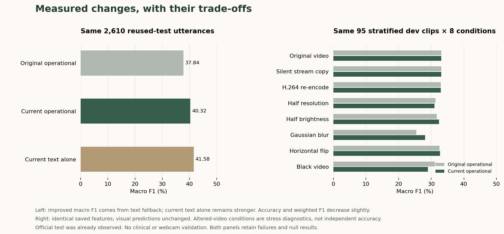

# Check-in: measured prototype and overnight backtests

Updated 25 September 2026. Check-in runs text + vision inference locally on the supplied Windows RTX 3080 10 GB / 32 GB RAM computer. It returns a structured MELD emotion tag and a streamed supportive reply. The browser is the interface; local Python encoders/classifiers and a local llama.cpp server perform inference.

The current prototype includes a stronger text fallback, video preparation that preserves decoded frames where the format permits, automatic clearing of a used clip, and a revised response prompt. **There is still no demonstrated accuracy gain from adding vision.** The evidence below includes failures and trade-offs. This is a reflection companion, not clinical assessment or treatment.

## Reliability follow-through

The subsequent pass corrected four reproduced stop/ownership failures. All eight fixed real-model cases, eight recovery turns and 48 alternating video/text burst turns passed. The four real context-boundary checks also passed, with explicit overflow errors and whole-history eviction. Model weights, prompt and sampler remain unchanged; confidence calibration was investigated and not deployed. The latest warm fusion p95 state/first-word/completion is **241/440/604 ms**, with **7,581 MiB** peak total GPU usage. The first-pass measurements below remain historical evidence. Full comparison, operational limits, confidence results and browser checks are in [the reliability report](reports/reliability/REPORT.md).

A later browser check reproduced and fixed delayed replay loading overwriting a fresh draft after reset. The fixed UI passed New/Stop/normal-load checks and the full **268-test** software suite. A real text+video replay completed; its known wrong emotion and response assumptions remain recorded in the [replay lifecycle report](reports/replay-lifecycle/REPORT.md).

## Current models and training

| Required component | Learned parameters |
|---|---:|
| Qwen3-4B-Instruct-2507, Q5_K_M | 4,022,468,096 |
| DeBERTa-v3-large | 434,012,160 |
| AffectNet-pretrained EmotiEffLib EfficientNet-B2, including original head | 7,710,857 |
| YuNet face detector, conservative allowance | 53,121 |
| MELD vision MLP, 1,408 → 128 → 7 | 181,255 |
| MELD linear text head, 1,024 → 7 | 7,175 |
| MELD fusion MLP, 2,435 → 128 → 7 | 312,711 |
| **Complete local inference path** | **4,464,745,375** |

All frozen weights count, and quantization does not reduce the parameter count. YuNet's allowance includes 17 nonlearned constants. Training-only standardization is folded into the linear head's weights and bias; there is no additional learned scaler or auxiliary generator. The original text head is retained as rollback material and is not required or loaded for current inference. The total leaves 1,535,254,625 parameters below the six-billion cap. See the [current parameter audit](reports/overnight/parameters.json), [architecture verification](manifests/architecture-counts.json), and [pinned model inventory](manifests/models.json).

All official MELD rows were prepared and encoded: **9,989 train / 1,109 dev / 2,610 test**. One dev clip is missing. The seven labels are neutral, surprise, fear, sadness, joy, disgust and anger. Both pretrained encoders remain frozen. Vision/fusion use the original MELD-trained MLPs; the new text classifier was selected by three-fold cross-validation that kept each training dialogue within one fold.

The predeclared classifier study tried 24 regularized linear configurations, requiring **72 cross-validation fits**, followed by three selected full-training fits. The selected text configuration used C=.01 and square-root class balancing. Its mean training-CV macro F1 was .4011 (folds .3888/.4046/.4100). Standardization and weights were fitted only within the training portion of each fold. These folds also selected hyperparameters, so this is not an unbiased nested-CV estimate. Selected fits converged; warnings from unsuccessful high-C alternatives are retained.

The multimodal route still requires at least six usable single-face frames out of eight, rejecting multiple faces and abrupt track changes. Coverage is 2,541 train / 316 dev / **658 test (25.21%)**. The remaining test rows use the text fallback. This geometric heuristic does not establish who is speaking. MELD utterance labels are not facial-expression ground truth, and television dialogue is not a validated webcam or therapy domain.

## Accuracy, uncertainty, and the selected change

The original test split was already inspected before the overnight work. Every subsequent test figure is a **reused benchmark**, not a fresh untouched holdout. The text configuration was frozen using training CV before its first reused-test pass. The fixed hybrid—old vision/fusion with the new text fallback—was defined after that pass, with development and compatibility gates recorded before its own evaluation. No alternate hybrids or thresholds were selected from test scores.

| Same population | Original operational model | Current operational model |
|---|---:|---:|
| Full development macro F1, 1,109 | .38059 | **.41855** |
| Full reused-test macro F1, 2,610 | .37845 | **.40324** |
| Full reused-test weighted F1, 2,610 | **.58479** | .58374 |
| Full reused-test accuracy, 2,610 | **.60115** | .59042 |
| Eligible reused-test macro F1, 658 | .36710 | .36710 |

The full-test macro difference is +.02479; a paired dialogue-cluster bootstrap gives a descriptive 95% interval of [.00158, .04749] (1,000 resamples of 280 dialogues). It is conditional on this already observed benchmark and selection history, not prospective validation. Weighted F1 is slightly lower. All eligible fusion predictions remain unchanged; gains come from fallback classification. The new text model alone reaches .41583 full-test macro F1, above the current multimodal system's .40324.

The current operational per-class F1 values are neutral .7615, surprise .5059, fear .1188, sadness .3025, joy .5024, disgust .2302, anger .4013. Disgust improves substantially while fear and anger worsen. Scores remain uncalibrated. Three test clips have exact video-byte overlap with training; the [original report](BASELINE_REPORT.md) retains the original duplicate-exclusion diagnostic. These later hybrid numbers use the full official split and do not silently exclude the duplicates.

The all-linear early/late-fusion alternatives were not deployed. The selected 90% text / 10% vision mixture did not beat its own text control on development or reused test. Baseline paired bootstrap analysis likewise found no reliable fusion advantage. See the [model study](reports/overnight/model-study/SUMMARY.md), frozen definitions and per-class results beside it, and [baseline statistics](reports/overnight/baseline-statistics.json).

## Video and multimodal stress tests

The predeclared stress run processed **95 development clips × 8 conditions = 760 real video conditions**, with no extraction errors, in 13.74 minutes. Text features stayed fixed while the real detector and vision encoder processed each altered video. The class-stratified cohort contains 16 examples per common class, 12 fear and only three disgust examples; it is not the natural dataset distribution.

| Video condition, same 95 dev examples | Usable vision | Original macro F1 | Current macro F1 | Current label changes from original video |
|---|---:|---:|---:|---:|
| Original | 95/95 | 0.3307 | 0.3307 | 0 |
| Silent stream copy | 95/95 | 0.3307 | 0.3307 | 0 |
| H.264 re-encode | 95/95 | 0.3296 | 0.3296 | 1 |
| Half resolution | 88/95 | 0.3134 | 0.3102 | 8 |
| Half brightness | 93/95 | 0.3166 | 0.3242 | 11 |
| Gaussian blur | 90/95 | 0.2542 | 0.2818 | 18 |
| Horizontal flip | 93/95 | 0.3253 | 0.3267 | 11 |
| Black-frame control | 0/95 | 0.3118 | 0.2896 | 33 |

The current-model column is a subsequent CPU replay over the exact saved features. It reproduced baseline probabilities within 1.79e-7 and left all **649 vision-eligible outputs exactly unchanged**. Remaining changes come exclusively from fallback. Blur/brightness improve on this cohort; half-resolution and black video regress. Missing vision correctly selects text fallback, but that does not guarantee a correct tag.

Twenty seeded permutations across all 316 eligible dev utterances paired each text with shuffled visual evidence. Mean macro F1 fell from .4017 to .3083; 90–113 labels changed per permutation. This establishes sensitivity to mismatched inputs, not causal emotional understanding or an accuracy benefit from vision. Alterations may change or remove meaningful evidence. Development was already used for model selection, so none of these stress figures are independent test accuracy. Frozen protocols, all conditions, failures, source hashes and compact feature artifacts are included in [the stress report](reports/overnight/robustness-dev/report.json) and [the fixed-head comparison](reports/overnight/robustness-hybrid-comparison.json).

The browser now removes audio by copying compatible H.264/VP8/VP9 video streams. Unsupported formats use an explicitly disclosed conversion. A separate real MELD regression confirmed that all 36 decoded frames of replay 4/2 were byte-identical after silent stream copy, with no audio remaining. The message and clip clear after a completed or stopped turn, and remain available after a failure for retry. Input controls are locked while a turn is being processed.

## Response grounding

**204 actual local Qwen generations** were recorded: 126 development comparisons across three predefined prompts, six identical-input repeat controls, 18 reserved authored checks after development selection, and 54 subsequent production-sampler replications. Cases included actual cached MELD development states and clearly identified synthetic changes to visual evidence. The latter are generator interventions, not emotion ground truth or real video tests.

The compact facts-first prompt was selected before generating reserved checks. Controlled development replies handled several ambiguous fragments and unwanted-achievement examples better. However, replies still sometimes presumed shared grief, welcomed an ambiguous event, omitted mixed feelings, or mishandled requests for outside contact. The production sampler also produced a medical-normality suggestion in one reply. These failures remain in the [response study](reports/overnight/response-study/README.md).

Narrow regex checks missed substantive failures and are not quality scores. Two of six identical requests changed output despite temperature zero and fixed seed, so response differences across evidence conditions alone do not prove useful visual conditioning. Production remains temperature .5, top_p .8, top_k 20, max 96 new tokens. There is no matched production-temperature baseline and no claim of general production-quality improvement or clinical validation.

## Interaction, speed, and resource use

The updated stack completed 30 fusion and ten no-video fallback replays after three excluded warm-up turns on Windows 11, an RTX 3080 (10,239.5 MiB VRAM), Ryzen 7 9700X and 31.10 GiB usable system RAM.

| Warm fusion timing, 30 measured turns | Median | p95 |
|---|---:|---:|
| Emotion state | 184 ms | 246 ms |
| First response token | 394 ms | 458 ms |
| Completed response | 514 ms | 623 ms |

Fallback first-token p50/p95 was 215/250 ms. GPU usage peaked at **7,566 MiB** (7.39 GiB), including desktop/background use. Python and generator resident-memory peaks were 3,177 and 3,288 MiB; total system usage peaked at 25,550 MiB including other applications. See [updated benchmark](reports/overnight/benchmark.json), [its provenance](reports/overnight/benchmark-provenance.json), and [hardware/software record](reports/environment.json). This rerun is not a controlled attribution of speed changes to a particular model or prompt.

“Real-time” means a turn-based interaction: a person records a 3–5 second clip and submits it with text, then receives the emotion state and streamed response promptly. The engineering target is state within one second and first text within two seconds after submission on a warm local stack. Capture, upload/preparation and browser rendering are outside the backend benchmark; cold startup is separate. This is not continuous video processing.

## Reproduce and inspect

Use [README.md](README.md) for Windows setup, installing the included heads, launching, the live/replay interface, and training/evaluation commands. [OVERNIGHT.md](OVERNIGHT.md) records the continuing work protocol; [the original report](BASELINE_REPORT.md) preserves baseline measurements. Protocols, model hashes, predictions, failures and selected artifacts accompany each study under `reports/overnight/`. Original and transformed television video is not bundled.

The first-pass combined CPU software suite passed **185 tests**, with one upstream deprecation warning. The [test report](reports/overnight/software-tests-final.xml) and [log](reports/overnight/software-tests-final.txt) distinguish contract checks from actual inference. Supplied heads installed successfully into a clean artifact directory; [the installation record](reports/overnight/portable-install.json) retains copied hashes.

An additional [actual multi-turn study](reports/overnight/interaction-study/report.json) completed **12/12 turns in six isolated conversations**: two transitions to missing-video fallback, two to fresh real dev pairs, and two deliberately mismatched pairs. All schema, event identity, streamed/final-text, history, fresh-clip and fallback checks passed (ten fusion turns, two text fallbacks). Its protocol was frozen before execution. This is operational validation, not response-quality scoring; one ambiguous fragment still elicited an invented “big moment.”

The [live browser check](reports/overnight/browser-verification.json) sent MELD replay 4/2 through the updated silent-video route, observed a real tag and response, then sent an authored text-only follow-up. The clip/message cleared correctly and the follow-up used `missing_video`/`text_fallback`. The first prediction remained wrong (anger versus the reference surprise) and the reply presumed excitement; both failures are recorded. The follow-up reflected the explicitly mixed feelings. New conversation reset the display, and the warmed app was left ready. Physical camera hardware remains untested.

The completed scope is local text + vision, MELD head training, explicit fallback, structured state, local response streaming, a professional browser interface, replay, measured backtests, parameter accounting and a runnable handoff. Audio, ASR/TTS, RL, robot integration, full backbone or language-model fine-tuning, verified speaker identification, continuous video, physical webcam validation, and clinical validation remain intentionally outside this prototype. External and AI-generated components are identified in [THIRD_PARTY.md](THIRD_PARTY.md).
