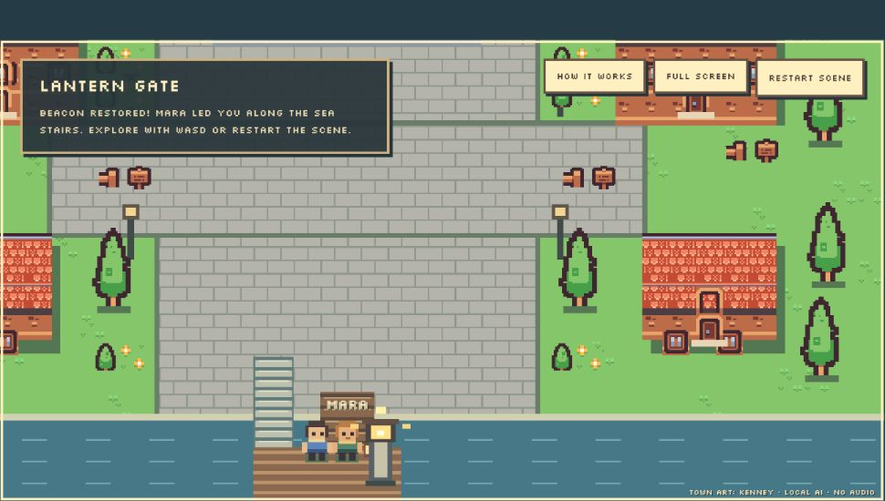

# Browser playtest: conversational follow-ups

This update follows the actual browser playtest after revision `74bb0e9`. That
test sampled 40 of 60 hand-authored custom prompts at random, entered the first
10 in sample order through the visible game textbox, and read Mara's replies
from the browser. It found a four-reply exact loop, an unchosen stairs plan,
missed explicit worry, and unnecessary route questions after a request to stay.

## Changes

- Ordinary custom remarks now receive a conversational goal instead of another
  route-selection or readiness question. A new explicit route choice still
  advances the game; unrelated follow-ups preserve the existing plan.
- Finished tone-example sentences are no longer supplied on every custom turn.
  The neutral example was being copied verbatim. Tone instructions remain, and
  the authored ambiguous demonstration buttons retain their tone examples.
- The game context explicitly outranks an earlier mistaken assistant reply.
  No selected route means neither route can be confirmed in dialogue.
- Present self-reports recognize “worried,” “uneasy,” and adverbs such as
  “actually.” Negation, quotation and hypothetical statements still abstain.
- Goals for pressure complaints, simple explanations, skepticism and waiting
  answer the current point without attaching another route question. These are
  instructions to the local model, not hardcoded finished NPC replies.

The perception models, generator weights, local inference architecture and
**4,464,745,375 total required learned parameters** are unchanged.

## Actual browser verification

Two fresh browser replays used the same ten inputs in the same order. The final
replay used the delivered code. Movement used the game keyboard controls; custom
text was entered into the visible textbox and submitted with Enter. No internal
game actions, inference endpoints, synthetic emotion overrides or model-API
requests were used for these replays. The camera stayed **off**, matching the
baseline. These are text-fallback interaction checks, not webcam validation.

The [baseline sample and replies](browser-fix/before.json),
[first revision](browser-fix/first-replay.json), and
[delivered revision](browser-fix/after.json) preserve the observed replies.

| Check | Before | Delivered browser replay |
|---|---|---|
| Repeated full replies | Four identical replies consecutively | Ten distinct replies; no identical-response loop |
| “I'm smiling, but I'm actually worried.” | Neutral direction; announces stairs without a choice | Explicit fear/reassuring direction; stays at the gate and offers a slower pace |
| “You seem very eager to leave.” | Repeats the route question | Acknowledges rushing and leaves control with the player |
| Request for a simple explanation | Repeats the route question | Explains that the optional task is relighting the beacon |
| “That sounds suspiciously easy.” | Repeats the route question | Discusses the task and uncertainty about the journey |
| “What happens if we just stay here?” | Answers, then asks for a route again | Says the beacon stays out and ends without a route question |

Three additional custom turns verified game progression through the UI:

1. “I prefer the sea stairs.” produced a route acknowledgment and readiness
   buttons; the journey did not start.
2. “Not yet.” kept the encounter at the gate.
3. “Lead the way.” closed the conversation and began the sea-stairs journey.
   The visible objective eventually read “Beacon restored! Mara led you along
   the sea stairs.” The final departure sentence was not read before the panel
   closed, so the record does not invent a quotation for it.

## Limits and software checks

The final wording is still imperfect. In particular, the worried/smiling reply
still starts “I see you're smiling, but worried” even though the generator only
receives words and emotion tags. A specific prompt reminder did not eliminate
that visual-sounding paraphrase. It remains an explicit failure in the saved
record. Some “no rush” phrasing is repetitive, and the first reply has two
questions instead of the requested maximum of one. No universal-coherence
claim is made.

The delivered source passes **617 Python tests** with one existing dependency
deprecation warning. [JUnit output](browser-fix/tests.xml) is retained. The new
regressions cover explicit versus negated/reported worry, custom follow-ups
under all three route states, staying consequences, and progression after an
actual choice. The frontend code was not changed. Prior JavaScript results and
the larger matrix remain historical evidence; the full 1,199-scenario matrix
was **not rerun or silently relabeled** for this prompt update.

This is a development replay of previously observed failures, not a fresh
holdout or an independent human evaluation. The before/after comparison uses
real conversation histories, which diverge as the generated replies change.
