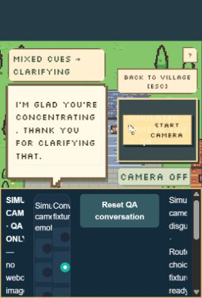

# Simulated-camera browser playtest

The requested **50 preset replies and 20 new custom replies** were entered through the visible game UI using computer use. Every final response was read. Seven MELD labels were selected through a clearly labeled QA radio control; the real local generator and production quest callbacks produced the replies. No direct inference endpoints were used to submit playtest cases.

## Outcome

- **70/70** observed route and departure states matched separately specified expectations. Refusals, hypothetical choices, questions and pauses did not cause unwanted departure.
- **52/70** final replies came from the local model (including any successful repair); **18/70** required a visibly labeled authored fallback after two rejected drafts. These are not 70 independently successful raw model generations.
- **65 distinct full replies**. Fear, joy and sadness produce noticeable wording differences in several paired examples. Neutral, surprise and disgust are still less consistently distinct.
- UI submission-to-completed-output median **940 ms**, p95 **1,482 ms**, maximum **2,703 ms** in this QA configuration. This includes browser overhead and uses CPU text classification plus the existing RTX 3080 generator. It is **not webcam or production end-to-end latency**.

The full 70-case before/after pass was followed by one focused recheck of case 64 after a final correction-specific guard and fallback-label contrast fix. The raw full pass is retained; the CSV uses that focused output for case 64. These cases were used to develop the fixes, not held out.

Software validation: **651 Python tests passed**, with one dependency deprecation warning; **13 JavaScript tests passed**.

## What changed

A changed mind followed by an explicit new preference now updates the selected route without granting departure consent. Polite requests such as “Can we pause?” count as pauses. Explicit feeling corrections after reported speech take priority over the camera cue.

The character instructions are shorter, with an authored task and delivery direction for each turn. Specific goals cover optional participation, unknown inspection history, appearance questions and requests for Mara to leave alone. The beacon's role as a navigation marker is now explicit scene canon; hypothetical ship accidents are not.

Game replies are buffered before display and checked for observed failure classes: unsupported route conditions or safety claims, visual-perception claims, repeated player lines, unwanted questions/departure, wrong routes, judgmental language and excessive length. One repair call uses the **same local model** and shared time budget. If it also fails, a bounded authored reply is marked “Grounded fallback” in the UI and `response_guard.source=authored_fallback` in state. The example note also identifies fallback use. This replaces immediate token-by-token display for game responses; it can add latency. No models or learned parameters were added.

## Examples actually read in the UI

| Input / simulated cue | Observed final response |
|---|---|
| “Oh, fantastic.” / fear | “The beacon is out. I’ll stay beside you if you’d like—no rush, just as you move.” |
| “Sure. Whatever.” / joy | “The beacon’s out, but we’ve got this. Bridge or stairs—what’s your pick?” |
| “My smile is just politeness; I'm worried about this.” / joy | “I hear you're worried. If you'd like, I can stay close and walk with you at your pace.” — stated fear overrides visual joy |
| “Do you know whether the bridge was inspected?” / disgust | “I do not know if the bridge was inspected. Inspection records are unknown.” |
| “I'm not disgusted; I'm just concentrating.” / disgust | “I'm glad you're concentrating. Thank you for clarifying that.” — focused final recheck |
| “Before we leave, which route did I pick?” / fear | “You chose the sea stairs; we're still at the gate.” — marked fallback |

## Limits

This is **simulated camera evidence**, not new vision accuracy testing. The QA build replaces classifier outputs with the selected vision/fusion label (.88 / .02 scores), retaining real text classification for disagreement. Actual face detection, feature extraction and learned fusion are bypassed. The classifier weights, MELD metrics and **4,464,745,375** parameter bound remain unchanged.

Stage fixtures deliberately reset history; this is not 70 consecutive turns. The QA build starts near Mara and holds departure animation for inspection. Production movement remains unchanged. The earlier dialogue matrix is historical and was not rerun. These guard rules cover observed failures and can miss novel paraphrases; fallback use is substantial, and some generated answers remain generic or mildly pushy (for example an unsolicited route suggestion). A different tone label does not prove that every reply expresses a distinct tone.

## Reproduce and inspect

With the local model server already running, run `python scripts/browser-camera-qa.py --home PATH_TO_ARTIFACTS` from the repository, then open `http://127.0.0.1:7862/`. Select an emotion and stage, press **Reset QA conversation**, then click a preset or submit custom text. Simulation exists only in this opt-in script; normal startup uses the real camera path.

- [70-case before/after transcript](camera-qa/transcript.csv)
- [Original baseline UI observations](camera-qa/before.json)
- [Full repaired UI observations](camera-qa/after.json)
- [Last focused recheck](camera-qa/focused-final.json)
- [Case plan](camera-qa/plan.json), [summary](camera-qa/summary.json), [source/artifact hashes](camera-qa/manifest.json)
- [Final Python test results](camera-qa/tests.xml)

After disabling simulation and restarting the normal app, a real camera-off smoke check of “I'm worried, but I'd like to help” returned “I hear you're worried. If you'd like, I can stay close and walk with you at your pace.” The stated-feeling cue was Fear → Reassuring. [UI observation](camera-qa/normal-app-final.json), [screenshot](camera-qa/normal-app-final.png).
