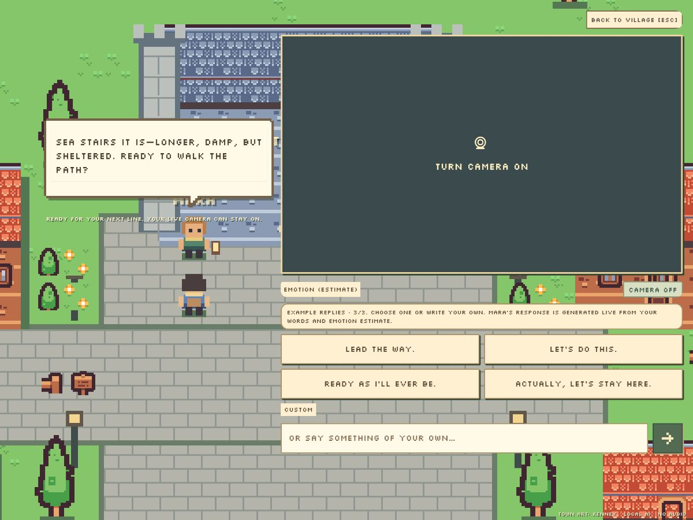
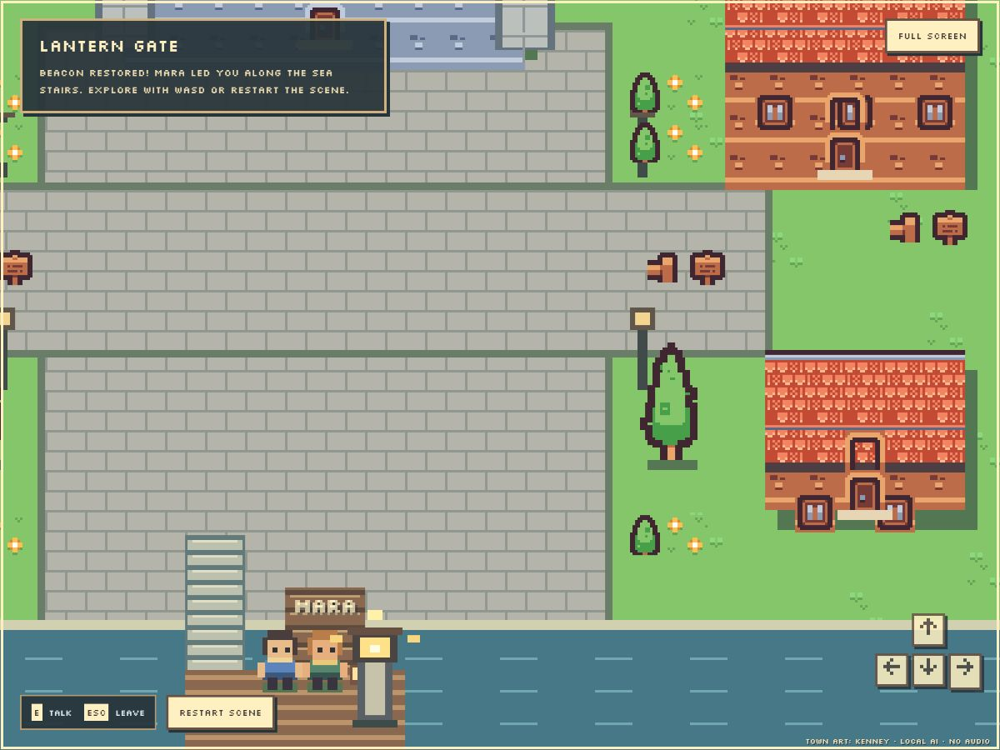

# Three-turn quest and emotion-driven dialogue

28 September 2026. Four **hardcoded example replies** change after each completed
NPC response: reaction, route selection, then readiness. Custom text remains
available throughout. The label explicitly distinguishes these authored player
examples from Mara's live local model response.

After three successful exchanges, a route choice and affirmative departure
trigger a six-second reading pause followed by the actual game sequence. Mara
walks the selected bridge or stone-stairs path, the player follows, and the harbor
beacon visibly lights. Escape pauses; E resumes. Restart scene clears the
conversation, choices, character positions and beacon. An unclear custom message,
refusal, cancellation or failed generation cannot initiate departure. There is
no save file, combat or inventory. An action whitelist and deterministic state
machine control the world; model-generated prose never issues executable commands.

## Emotion conditioning

Mara now reacts to the player before offering one small next step. Authored
delivery directions and short voice examples make joy playful, fear reassuring,
anger concise, sadness companionable, surprise animated and disgust wry.
These are prompt directions, not canned NPC answers. Eligible vision selects
delivery for the exact scripted examples; otherwise the combined estimate and
disagreement handling remain in use. Recognized explicit first-person feelings
take precedence over a conflicting estimate. The classifier label is unchanged.
Route choice, difficulty and world outcome never depend on emotion.

The same 12 synthetic evidence interventions were run through the existing
local generator [before](emotion-before.json) and [after](emotion-after.json),
with **24 real responses and no generation errors**. Seven labels share the
same opening words; joy/fear pairs repeat route acknowledgment and departure;
the final case pits explicit fear against a joy visual cue. Each file stores
the full prompt, its hash, direction, response and isolated generation timing.

For “Oh, fantastic.”, the previous fear response mainly described route
properties. The revised response begins “No rush. I'll be right beside you”.
The joy response opens with playful storm banter. For “The sea stairs, then.”,
fear offers steady company, while joy uses playful adventure language. Explicit
fear now selects the reassuring direction despite the conflicting joy cue.
These are qualitative observations from fixed synthetic interventions, not human
ratings, real-camera accuracy, fresh holdouts or an estimate of general quality.

The model still sometimes repeats its voice example, uses Markdown emphasis,
adds unsupported atmospheric claims, asks extra questions or exceeds two
sentences. One revised anger response incorrectly implied the already-dark
beacon was still flickering. This does not change the deterministic world state.
No accuracy gain, factual-perfection claim or safety guarantee is made.

## Verification

- Full Python suite after the quest change: **357 passed**, one existing
  deprecation warning. After the dialogue-prompt revision and explicit-feelings
  test, the **73 affected UI, lifecycle, character and quest checks passed**.
- **13 Node tests passed**, including both route trajectories, endpoint validity,
  idempotent completion, collision, movement and camera lifecycle.
- Live browser: the three example sets changed in order; a real three-turn
  sea-stairs conversation completed; the updated prompt was then used for a full
  bridge conversation; both routes moved Mara and the player to the pier;
  `beaconLit` became true. Restart restored the original positions, dark beacon
  and zero completed turns. Camera was off during this browser run.
- Tests cover stale queued examples, failure/cancellation without advancement,
  explicit route changes, ambiguous custom questions, refusals, text-over-vision
  precedence and whitelisting of the game context supplied to the generator.

All inference remains local; required weights are unchanged at
**4,464,745,375 learned parameters**. No test-set tuning or new model training was
performed. Reproduce the paired protocol with
`python scripts/evaluate-game-emotion.py --output PATH.json`, using the local
generator and keeping other GPU inference idle. Existing hardware and benchmark
reports still apply only to the measurements they actually contain.
