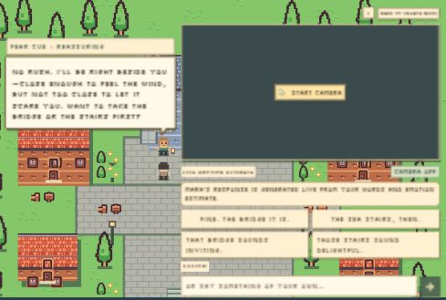
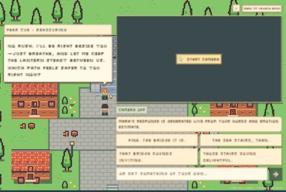

# Visible reply cues and NPC reactions

29 September 2026. Each generated reply now carries a compact pixel label
showing the selected emotion cue and response style, with evidence source in its tooltip. This
uses the same stored direction supplied to the local generator. The continuously
updated camera tag has a separate output and cannot overwrite a reply's label.
Explicit first-person feelings can override camera evidence; disagreements on
non-example text are shown as mixed cues instead of claiming one visual emotion.

Mara's actual in-world sprite changes its face and pose with that direction:
playful grin and lifted lantern, reassuring open hand, direct nod, gentle hand
over heart, curious eyebrow, wry smile or practical nod. Brief nod/lantern motion
occurs once per response and respects reduced-motion preferences. No portrait
overlay, replay button or new learned model was added. Route choices and quest
outcomes remain independent of these poses. Dialogue and input text were enlarged.
The speech bubble grows to fit its contents instead of imposing an internal
scroll area. The camera preview contains a small raised start button with a
pixel cursor. The reply explanation keeps only the live-generation sentence.

The previous reply retains its cue during the next classification step and on
failure before any replacement text. The first new text switches both the cue
and pose. New conversation clears both.

Verification: 65 focused Python tests and 13 existing Node tests passed. The
Python checks cover visual versus fused cue attribution, explicit words taking
precedence, missing camera, disagreement, escaped identifiers, new-response
timing, failure preservation and camera-output isolation. JavaScript syntax
validation passed. Browser checks used real local generation with camera off
and explicit joy, fear and anger statements. They are interface checks, not
camera-accuracy measurements. Visual-cue attribution was exercised with
controlled test fixtures, not claimed as new webcam validation.

Final desktop browser check at a 1200 × 800 CSS viewport: response text was
20px, the remaining explanation 16px, and the start button about 42px tall
inside a 362px-tall camera area. The response's inner content height matched
its 190px rendered height with visible overflow rather than internal scrolling.
The bubble ended 26px above Mara's head, leaving space for its pixel tail.

The label names the application's selected direction; it is not an automatic
evaluation of the generated response. Model output can still exceed the desired
length or deviate from the tone. Existing evaluation results and all parameter
counts remain unchanged at 4,464,745,375 required learned parameters.

## Simplified controls and retained camera tag

The response callbacks (four samples, Send and Enter) now restrict Gradio's
loading indicator to the chat component. Camera updates, composer edits,
replay preparation and reset callbacks do not put loading overlays on the
other controls. Gradio's separate blue webcam stream countdown is hidden with
a camera-scoped CSS rule; capture cadence and response progress are unchanged.
The visible Custom and Live emotion estimate captions were
removed. The accessible input label remains, with no visible label spacing;
the input begins eight pixels below the four samples at the tested desktop
viewport.

The camera pill keeps its last successfully detected emotion through missing
frames, model contention and expiry, adding “· last” when the reading is no
longer current. Its tooltip explains that it is historical. This retained tag
is presentation only: it cannot extend the four-second fusion eligibility,
alter smoothing, or condition a response using expired evidence. Camera off,
new conversations, new camera epochs and ambiguous face changes clear it.
Before any usable camera evidence the pill says “No reading yet”; it never
invents a neutral emotion or says “Waiting for camera.”

Verification for this follow-up: 97 Python tests and 13 Node tests passed,
including expiration during a response, recovery, missing/ambiguous faces,
session and camera reset isolation, and progress output ownership. A real
local generation in the browser showed one queued progress indicator, attached
only to the response. Mara completed a reassuring reply to an explicit nervous
statement. This run kept the camera off; camera-retention behavior was checked
with controlled fixtures. The response bubble had equal client and scroll
heights (190px), with no internal scrolling. No models or benchmark scores changed.

